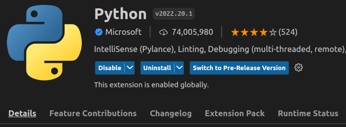
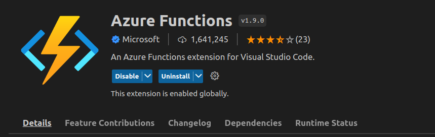
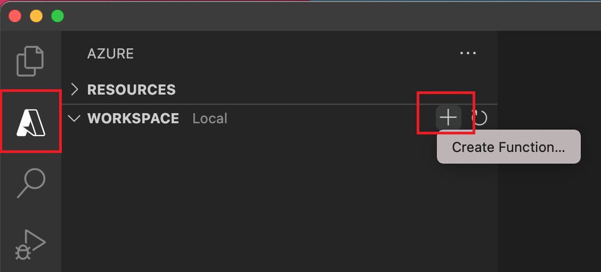
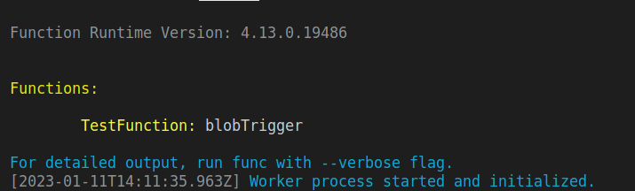
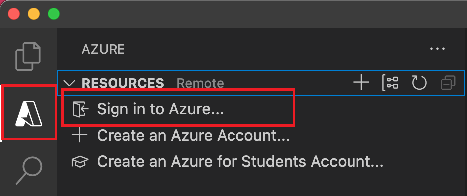
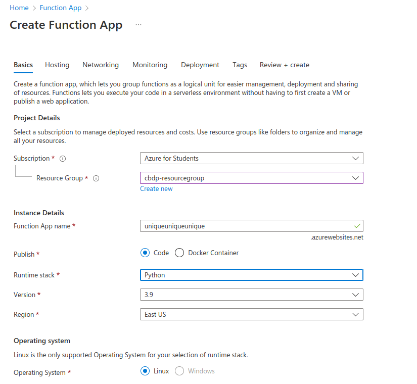
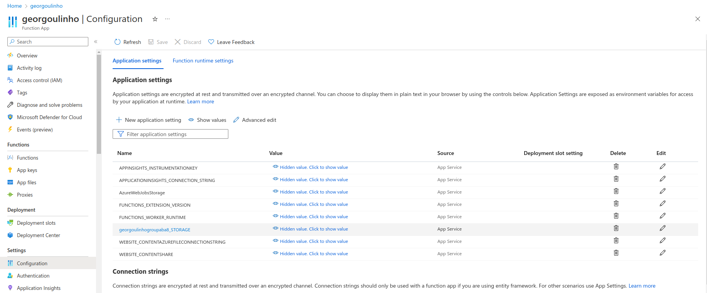
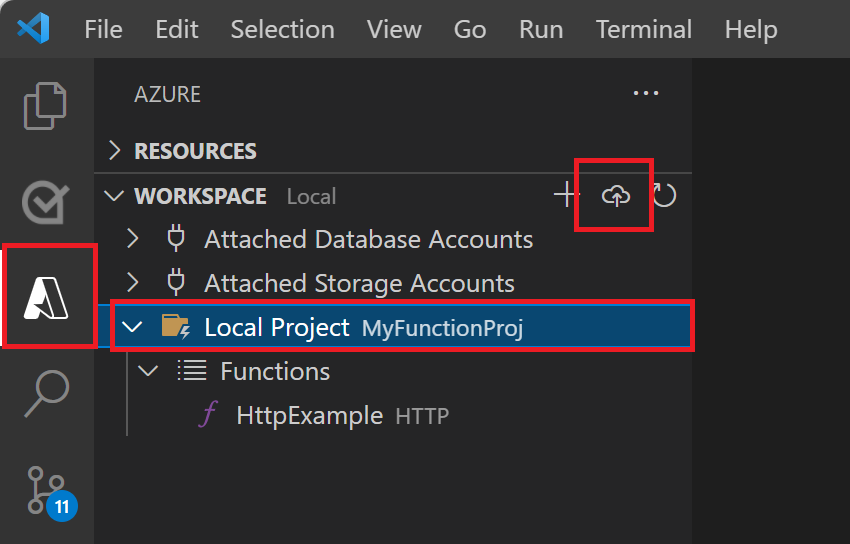
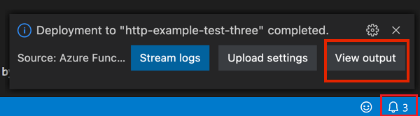
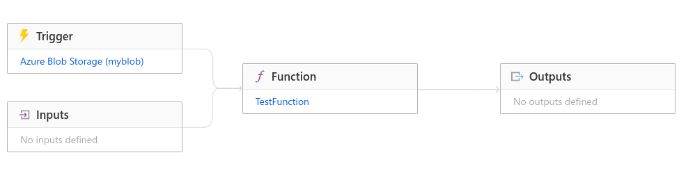

# Example: Event-driven line count function (Python)

Here you can find an example of setting up an Azure Functions project using Python.

In this example, we implement a function that is triggered each time a CSV file is uploaded to a specific storage blob container. It then proceeds to count the lines of the CSV file and upload the result in a separate file in the same blob container

We used the [VS Code plug-in](https://learn.microsoft.com/en-us/azure/azure-functions/create-first-function-vs-code-python?pivots=python-mode-configuration) to implement it, which is quite easy-to-use, but you can also follow it outside VS Code should you wish to do so.

## Prerequisites

- An Azure account with an active subscription. In case you had not followed the 4th assignment you can find how to get student credits [here](https://gitlab.db.in.tum.de/cloud-based-data-processing-22/assignment-4/-/blob/main/AZURE_TUTORIAL.md).

- The [Azure Functions Core Tools](https://learn.microsoft.com/en-us/azure/azure-functions/functions-run-local#install-the-azure-functions-core-tools) version 4.x.

- Python versions that are supported by Azure Functions (one of Python 3.9, 3.8, 3.7, preferably 3.9). 

- As we will be running the function in a virtual environment in VSCode, make sure that you also install the related package. For example, if you are using python3.9, you will need to:

```
sudo apt install python3.9-venv
```

- Visual Studio Code on one of the [supported platforms](https://code.visualstudio.com/docs/supporting/requirements#_platforms).

For this tutorial where we will be using Visual Studio Code you will also need:
- The Python extension for Visual Studio Code. 
 
  


- The Azure Functions extension for Visual Studio Code, version 1.8.3 or a later version.
 
  

## Local Project Setup

Choose the Azure icon in the Activity bar. Then in the Workspace (local) area, select the + button, choose Create Function in the dropdown. When prompted, choose Create new project.



Answer to the prompts as follows:

- Select a language -> **Python**

- Select a Python interpreter to create a virtual environment -> choose your preferred Python interpreter. If an option isn't shown, type in the full path to your Python binary. Don't forget that only Python 3.9,3.8, and 3.7 are supported by Azure Functions.

- Select a template for your project's first function -> **Azure Blob Storage Trigger**

- Provide a function name -> whatever you want

- Select setting from "local.settings.json" -> **Create new local app setting**

- If not logged in, you will be prompted to select a subscription, so choose **Sign in to Azure** and login with your account. You might need to do this twice until VS Code is synchronised. Logging out is only possible via CTRL+SHIFT+P

- Select subscription -> **Azure for Students**

- Select storage account -> select one of your storage accounts or create a new one

- Create new Azure Blob Storage Trigger -> testcontainer/{name} (make sure that the container exists inside this storage account)

- Specify the directory location for your project workspace and choose Select. You should either create a new folder or choose an empty folder for the project workspace. Don't choose a project folder that is already part of a workspace.

Visual Studio Code uses the provided information and generates an Azure Functions project with a Blob Storage trigger. You can view the local project files in the Explorer. For more information about the files that are created, see the getting_started.md file that was generated.

## Function Code

The `__init__.py` file is used to define the entry point of the function app, the bindings and other settings that the Azure Functions runtime needs to know about when running the functions. It usually includes import statements for the necessary modules, definition of the functions and the configuration of the function triggers and input/output bindings.

Paste the following code inside your `__init__.py`, and also provide the **connection string** for your storage account, as well as the **container name** if it is different than "testcontainer".

You can find the connection string from the Azure Portal, by going to your storage account, and then Access Keys-> Connection String.

```Python
import logging
import azure.functions as func
from azure.storage.blob import BlobClient, ContainerClient

def main(myblob: func.InputStream):
    logging.info(f"Python blob trigger function processed blob \n"
                 f"Name: {myblob.name}\n"
                 f"Blob Size: {myblob.read} bytes")

    blob_text = myblob.read()

    # Count the number of lines in the blob
    line_count = len(blob_text.splitlines())
    print("The file", {myblob.name}, "contains", line_count, "lines")

    # Provide the connection string for your storage account
    connection_string = "YOUR_CONNECTION_STRING"

    # Upload the line count for each blob inside a new directory
    container_client = ContainerClient.from_connection_string(connection_string, "testcontainer")
    result_blob = container_client.get_blob_client(myblob.name+"-result")
    result_blob.upload_blob(str(line_count))
```

Make sure that your **requirements.txt** file includes both azure-functions and azure-storage-blob.

```PYTHON
# DO NOT include azure-functions-worker in this file
# The Python Worker is managed by Azure Functions platform
# Manually managing azure-functions-worker may cause unexpected issues

azure-functions
azure-storage-blob 
```

Edit your **function.json** file to look like this. Include the **path to your container** as well as your **storage account name** instead of cbdpXXX.

```JSON
{
  "scriptFile": "__init__.py",
  "bindings": [
    {
      "name": "myblob",
      "type": "blobTrigger",
      "direction": "in",
      "path": "PATH_TO_YOUR_CONTAINER/{name}.csv",
      "connection": "cbdpXXX_STORAGE"
    }
  ]
}
```

In our example, we use a single function triggered by a Blob Storage trigger. The function's name is "myblob" and it is triggered by the arrival of a .csv file in a container in the storage account specified by the "connection" field. The path is specified in the "path" field and the name of the file is captured by the {name} in the path and passed as an argument to the function.

The scriptFile field specifies the name of the script file containing the function implementation, in this case it is __init__.py which is the main script that contains the function logic.

The bindings field is an array of objects where each object represents a binding used by the function. In this example, the function uses one binding of type "blobTrigger" and the direction is "in" because the function reads the contents of the blob.

Finally, edit the **local.settings.json** file to look like this, and include your connection string as well as your container name instead of cbdpXXX:
```JSON
{
  "IsEncrypted": false,
  "Values": {
    "AzureWebJobsStorage": "YOUR_CONNECTION_STRING",
    "FUNCTIONS_WORKER_RUNTIME": "python",
    "cbdpXXX_STORAGE": "YOUR_CONNECTION_STRING"
  }
}
```

The local.settings.json file is used to store configuration values that are specific to your local development environment.

## Run the function locally

Visual Studio Code integrates with Azure Functions Core tools to let you run this project on your local development computer before you publish to Azure, and avoid consuming cloud credits before your functions are in a working state.

To start the function locally, press F5. The Terminal panel displays the Output from Core Tools, which will be like this. 



(If you have trouble running on Windows, make sure that the default terminal for Visual Studio Code isn't set to WSL Bash.)

With Core Tools still running in Terminal, upload a CSV file to the blob that you are monitoring. If everything was setup well, after a few seconds you should see a new directory being created in the blob, containing a file.csv-result file with the line count of file.csv. 


## Deploy on Azure

In order to deploy your application in Azure, first of all you need to sign in to Azure through VS Code.



Then, you will need to create a Function App in Azure, which you can do through the Azure Portal.

Find a unique name for your function app, specify the runtime and version and in the Plan Type, choose Consumption.

In the ResourceGroup, you can choose to include the Function App inside the resource group where the container which you were triggering is located.



Keep the defaults in the following tabs, and click **Create**

Before deploying, make sure that you include any environment variables that you used locally (from your local.settings.json), in the Function App configuration. The local.settings.json file is used to store configuration values that are specific to your local development environment. When deploying your function app to Azure, these settings are not automatically included, so you'll need to manually add them to the Azure Functions App Configuration.


 In our case, you will need to include the cbdpXXX_STORAGE environment variable, from the container you are using. 



You are now ready to deploy your function.

Choose the Azure icon in the Activity bar, then in the Workspace area, select your project folder and select the Deploy... button.



Select Deploy to Function App..., choose the function app you just created, and select Deploy.

After deployment completes, select View Output to view the creation and deployment results, including the Azure resources that you created. If you miss the notification, select the bell icon in the lower right corner to see it again.



After this step your function will have started running in Azure, and will be triggered in case a csv file is uploaded in the blob container we are monitoring.

You can use the Azure Functions monitoring tools to verify that everything was set up well, and you can test if it works correctly by uploading CSV files to the blob.

## Monitoring



## Other tutorials/examples

This example is based on the tutorial [here](https://learn.microsoft.com/en-us/azure/azure-functions/create-first-function-vs-code-python?pivots=python-mode-configuration#sign-in-to-azure).