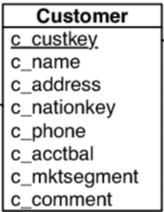

# Serverless Distributed Data Processing Pipeline

In this project, you will have to build a distributed data processing pipeline using Azure Functions.

The pipeline will receive CSV files containing customer data, and the goal is to calculate the mean customer account balance per country for demographic analysis purposes.

## Pipeline Requirements

Your solution will have to be a **multi-stage** pipeline, with a different function for each stage (e.g. 1. partitioning 2. aggregating 3. merging). It should also be **scalable**, allowing for multiple function instances to process data in parallel in case of handling large data amounts. 

Each function instance has its own environment and state, so make sure that your functions are designed to be **stateless** and are able to share data between instances. There are different means of sharing state between the stages in Azure. (e.g. Azure Blob Storage, Azure Queue Storage, Azure Table Storage, Azure Event Hub, Shared Database).

## Shared State Requirements and Tasks

Experiment with two options for sharing state, and provide two alternative working pipelines for the problem (e.g. one storing intermediate data at Azure Blob Storage and one at Azure Queue Storage).

You will then compare the two pipelines in terms of data processing speed, resource usage, and monetary cost. Document the pros and cons of each implementation, and, optionally, provide a recommendation for the best approach depending on the specific use case.

## Dataset

The dataset that we use is the customers table from the TPC-H benchmark, which is a benchmark widely used in research to benchmark databases.

You can download a 1 GB file to start with from our server. 

```
wget https://db.in.tum.de/teaching/ws2223/clouddataprocessing/data/customer.csv
```

You can find tools and instructions on how to generate a larger dataset [here](testing_data/).

You can also find scripts to partition it in 100 chunks.

```
cd testing_data
chmod +x splitCSV.sh
./splitCSV.sh customer.csv
```

### Table Columns



The dataset is a CSV file with 8 data columns (customer key, customer name, address, nation key, phone, account balance, market segment, comment)

## Query

Find the mean customer account balance per nation. (for each value of the 4th column, find the mean value of the 6th column).

You can find the result of the query for the 1GB file in the testqueryresult.txt.

## Tests

You can find a simple test.py file that uploads a file from a filelist.txt file to an Azure Blob container every 10 seconds. You can configure it and use it as a basis for testing. The filelist.txt file involves the names of all the 100 partitions from the above step. 

Apart from that, you will need to implement:
- load test(s) to measure response time and throughput of the pipeline for a large number of concurrent data uploads
- scale test(s) to measure how using more function instances in the pipeline stages that are stressed will affect response time and throughput. You can also use the autoscaling option of Azure Functions and observe how the number of instances changes when there is more or less traffic.

## Report Questions

- How did you design and implement the data processing pipeline? Include a high level diagram with the different types of functions that you are using with their inputs and outputs being shown clearly (you can use the images provided in the Function monitor in the Azure Portal). Explain your design decisions.

- How did you ensure that the pipeline could scale and handle large amount of data? How do different approaches to scaling the pipeline in Azure Functions (Manual Scaling, Autoscaling, Consumption Plan), impact the overall performance and efficiency of the pipeline?

- How did you experiment with different means of sharing state between pipeline stages? Which means of sharing state did you use in your pipelines and why? What types of triggers did you use?

- How does the performance of the two pipelines compare in terms of data processing speed, storage usage, and cost?

- What are the pros and cons of each approach, and which one would you recommend for the use case of the project?

- What changes would you make to your pipeline to handle potential instance failures, and make it fault tolerant? 

- Describe the tests that you implemented, and include their results and your conclusions.

- (Optional) How would you handle stragglers in your pipeline?

- What were the main challenges you faced during the development process?


## Implementation Steps

- Decide on the different functions that will make up your pipeline.

- Configure the triggers and bindings used by the functions. You can find some of the available trigger options [here](AZURE_FUNCTIONS_MATERIAL.md), as well as in the Azure [documentation](https://learn.microsoft.com/en-us/azure/azure-functions/functions-bindings-storage-blob-input?tabs=in-process%2Cextensionv5&pivots=programming-language-python).

- Write the code for the functions, which will perform the different data processing tasks (e.g. filtering, partitioning, aggregating data), in the programming language of your preference.

- Test the pipeline locally using the [Azure Functions Core Tools](https://learn.microsoft.com/en-us/azure/azure-functions/functions-run-local?tabs=v4%2Clinux%2Ccsharp%2Cportal%2Cbash), to ensure that it is working as expected. 

- We recommend using the [Plugin for VS Code](https://learn.microsoft.com/en-us/azure/azure-functions/functions-develop-vs-code?tabs=csharp) to create and deploy your Azure Functions applications, which is easy to use and configure. You can also use the Azure Functions CLI ([GitHub](https://github.com/Azure/azure-functions-cli)) and there is a [Plugin for Visual Studio](https://learn.microsoft.com/en-us/azure/azure-functions/functions-develop-vs?tabs=in-process) too.

- Once you have tested your functions locally and are satisfied with their behavior, you can deploy them to Azure.

- IMPORTANT: After deploying to Azure, don't forget to delete your functions after you have finished your experiments, to avoid consuming extra credits.

## Submission and deliverables

You can submit everything via GitLab.
First fork this repository, and add all members of your group to a single repository.
Then, in this group repository, add:
* Names of all members of your group in a groupMembers.txt file
* Code that implements the functions of your pipeline(s).
* Performance test scripts that you used to evaluate the performance of your pipelines.
* A written report (3-4 pages) giving a brief description of your implementation, and answering the design questions.

## Example in Python

You can find instructions on how to run and deploy a simple [Azure Functions application](PYTHON_VSCODE_EXAMPLE.md) that counts the lines of CSV files uploaded to a blob storage container. The example is written in Python and uses the VS Code Azure Functions plug-in.

## Background Reading
If the topic interests you and you want to read more about the current state of serverless computing as well as some interesting research systems I have upload four papers on Moodle in the background reading folder:

Survey Papers:
- Serverless Computing: One Step Forward, Two Steps Back
- Le Taureau: Deconstructing the Serverless Landscape & A Look Forward

Systems from Academia:
- Lambada: Interactive Data Analytics on Cold Data Using Serverless Cloud Infrastructure
- Starling: A Scalable Query Engine on Cloud Functions